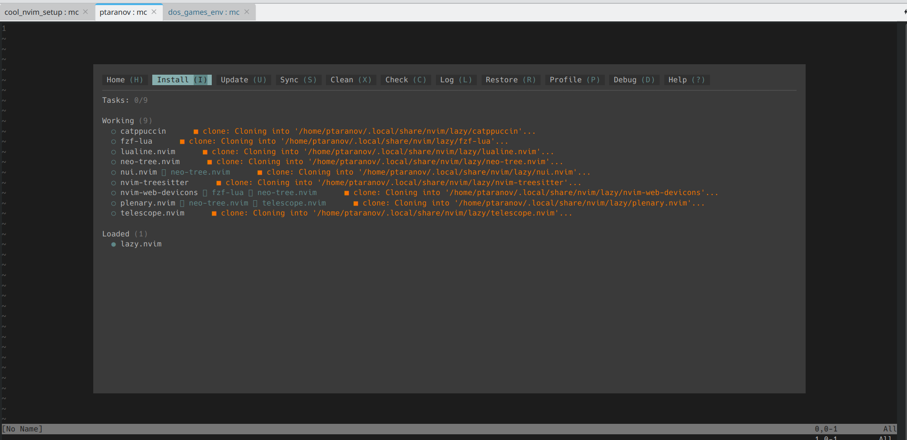
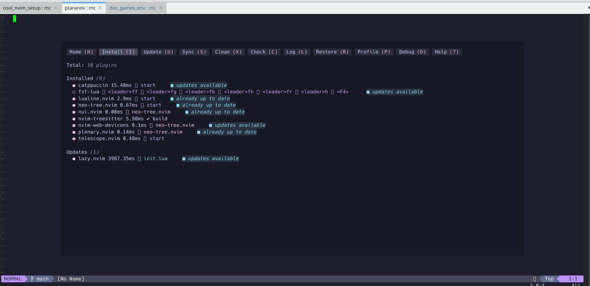
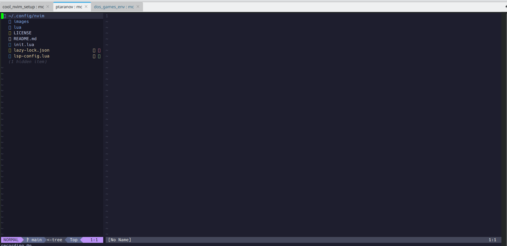
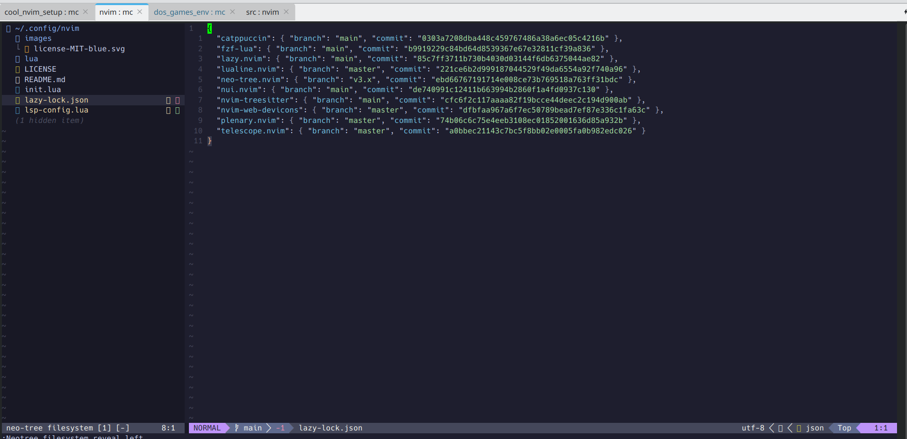

<div align="center">
    
</div>


# Intro
Cool [Neovim](https://neovim.io) setup.\
The whole idea is to gather all next features:
* File system tree view
* File browsing history
* grep like functionaliry
* find like functionaliry
* editor features
  * identation
  * highlighting
  * copy-pasting nvim <-> host
* Language Server Protocol
  * bash
  * python
  * C/C++
  * JS


# Setup 
Install neovim itself and some mandatory packages:
```
sudo apt update \
 && sudo apt install -y neovim \
                        ripgrep \
                        fzf
```

Neovim plugins (especially Treesitter) require a compiler to build syntax highlighting parsers.\
Install this ones.
```
sudo apt update \
 && sudo apt install build-essential
```


# Clone actual setup
Clone this repository into user home folder:
```
git clone https://github.com/donDonald/cool_nvim_setup.git ~/.config/nvim
```
This shall be enough.\
Than simply start nvim:
```
nvim
```
Omce started for the 1st time neovim will install all plugins.\
Lazy plugin manager will popup.\
***q*** to quit Lazy. \
***F2*** to popup Lazy back.

<div align="center"></div>
<div align="center"></div>

***Ctrl+t*** to show tree view.\
Than simply navigate to any file and hit Enter.
<div align="center"></div>
<div align="center"></div>


To cleanup neovin plugins setup:
```
rm -rf ~/.local/share/nvim/lazy/
rm -rf ~/.config/nvim
```


# Hot keys

## Help
* F1 - toggle help popup with basic hot-keys(TOBEDONE)

## Plugins management
* F2 - toggle Lazy plugin manager

## File tree view
* <leader>t, <C-t> - show tree view, jump inside this one.
* <leader>tt - hide tree view.

## Find and grep tools
* F3, <leader>h - show navigation history
* F4, <leader>f - find file by name
* F5, <leader>g - grep actual folder

## Others
* <C-z> - swith to parent/background
* fg<CR> - get back to nvin
