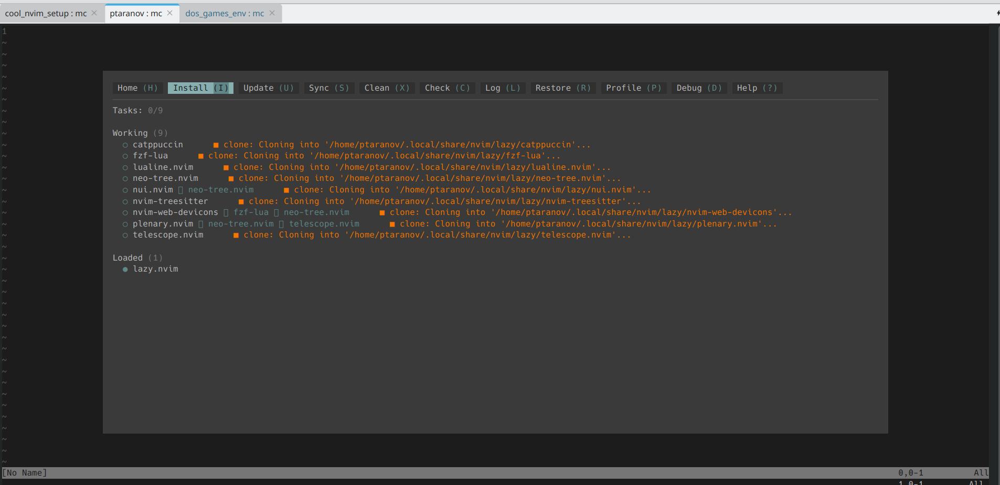
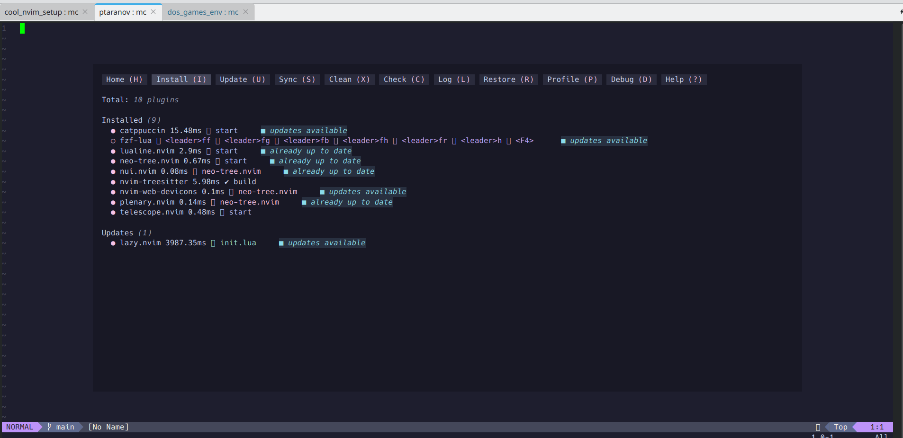
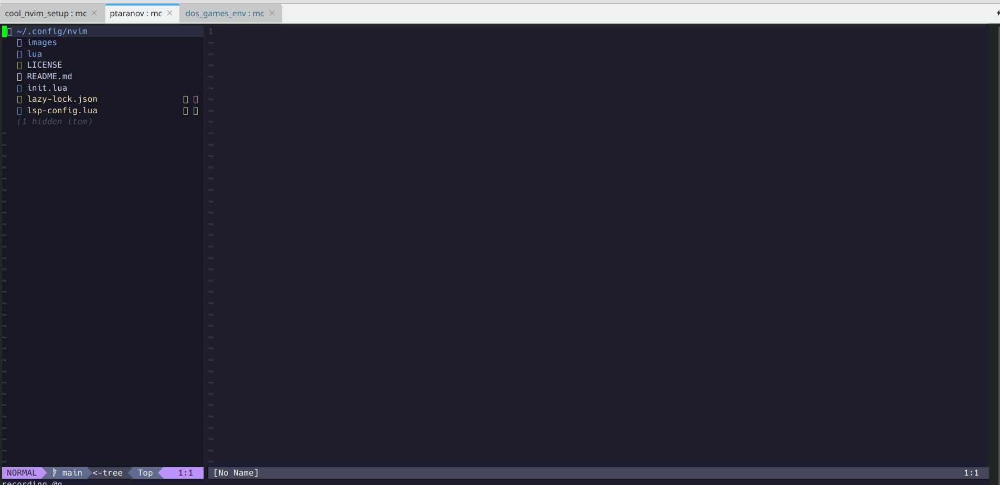
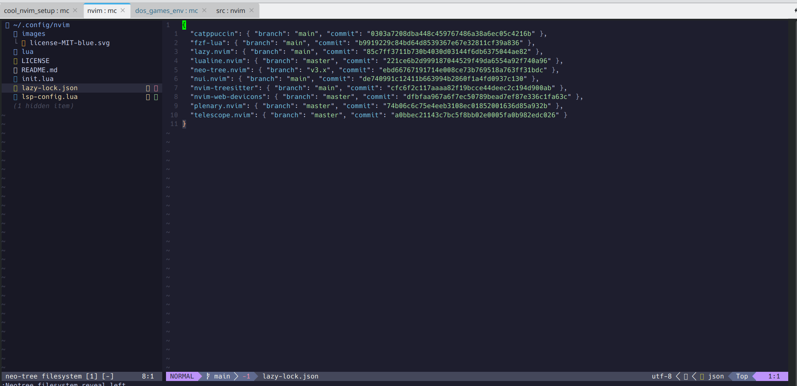
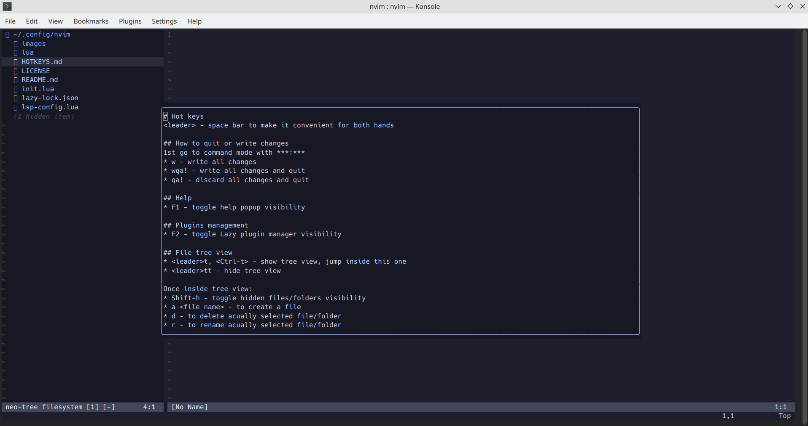

<div align="center">
    
</div>


# Intro
Cool [Neovim](https://neovim.io) setup.\
The whole idea is to gather all next features:
* File system tree view
* File browsing history
* grep like functionaliry (Telescope and Fzf)
* find like functionaliry (Telescope and Fzf)
* editor features
  * identation
  * commentaries
  * highlighting
  * copy-pasting nvim <-> host
* Language Server Protocol
  * bash
  * python
  * C/C++
  * JS


# Setup 
```
sudo apt update \
 && sudo apt install -y ripgrep
```

> [!WARNING]
> Versions of is very important to get things working.
> neovim - v0.11.6


## Install proper version of neovin 0.11.6
```
mkdir -p ~/Download/tbr.neovimsetup
cd ~/Download/tbr.neovimsetup
wget https://github.com/neovim/neovim/releases/download/v0.11.6/nvim-linux-x86_64.tar.gz .
tar xzvf ./nvim-linux-x86_64.tar.gz
sudo cp -rf ./nvim-linux-x86_64/* /usr/local
```
That it!\
Double check neovim version:
```
nvim --version
```
shall be this:
```
NVIM v0.11.6
Build type: Release
LuaJIT 2.1.1741730670
Run "nvim -V1 -v" for more info
```


## Install proper version of fzf
To make features like history working have to install proper version of fzf.\
Latest recommended version is 0.52.1.\
Still newer version shall be good.
```
sudo apt purge fzf
cd ~/Downloads/
wget https://github.com/junegunn/fzf/releases/download/v0.74.4/fzf-0.74.4-linux_amd64.tar.gz
sudo tar -xvf fzf-0.74.4-linux_amd64.tar.gz -C /usr/local/bin/
```


## Install Treesitter
Neovim plugins (especially Treesitter) require a compiler to build syntax highlighting parsers.\
Install this ones.
```
sudo apt update \
 && sudo apt install build-essential
```


# Clone actual setup
Clone this repository into user home folder:
```
git clone https://github.com/donDonald/cool_nvim_setup.git ~/.config/nvim
```
This shall be enough.\
Than simply start nvim:
```
nvim
```
Omce started for the 1st time neovim will install all plugins.\
Lazy plugin manager will popup.\
***q*** to quit Lazy. \
***F2*** to popup Lazy back.

<div align="center"></div>
<div align="center"></div>

***Ctrl+t*** to show tree view.\
Than simply navigate to any file and hit Enter.
<div align="center"></div>
<div align="center"></div>


To cleanup neovin plugins setup:
```
rm -rf ~/.local/share/nvim/lazy/
rm -rf ~/.config/nvim
```


# Hot keys
Check out [hotkeys](HOTKEYS.md).\
Or simply ***F1*** to toggle help popup.
<div align="center"></div>
